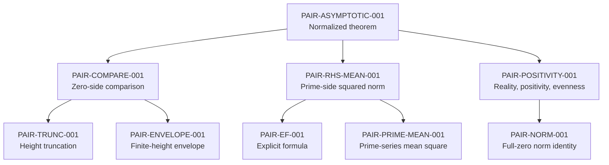

# Pair theorem dependency graph

Task: exposition. Assumptions: `UNCONDITIONAL`.
Snapshot checked: 2026-09-28.
Root: `PAIR-ASYMPTOTIC-001`.
Authority: [the theorem ledger](theorem-ledger.yaml).
Conventions: [project notation](notation.md).

## Scope and reading conventions

This is a complete map of the **currently recorded dependencies** of the
local normalized pair theorem: 26 claims (18 local and eight imported),
four source pointers, and 39 directed edges from the ledger's
`dependencies` lists. Of those edges, 34 connect claims and five point
from an imported claim to source provenance. It is not a reconstruction
of every upstream proof.

An arrow `A --> B` means “A uses B.” The overview below displays selected
direct claim dependencies; the inventory tables give every recorded edge.
Dependencies whose target is a source pointer identify where an imported
proof is documented, rather than asserting an additional proved claim.
Source pointers carry audit statuses, not theorem statuses.

Every claim in this closure has assumption `UNCONDITIONAL`.
All local claims remain `proved-draft`, and every claim's independent
verification remains pending. An imported claim's `published` status
records publication, not independent project verification.
“No dependencies recorded” at an imported input does not establish
foundational completeness. Existing `dependency_graph_complete` flags
are unchanged.

The computation column reproduces the meaning of
`computation_used_in_proof`: **No** is false in the ledger;
**External** denotes a published computer-assisted input;
**Inherited** denotes its use through the local analytic proof chain.
No local computation is used in the proof of the root theorem,
comparison, or envelope. Regression checks do not certify analytic estimates.

## Overview

The final assembly uses the exact identity `R=L` in
`PAIR-RHS-MEAN-001`, then divides the comparison by
\(T\log T\). Positivity supplies exact evenness for the negative
frequency range. All ordered occurrence pairs, full complex zeros,
multiplicities, and the inclusive height endpoint are retained.
The theorem's closed range is \(T\geq3, |\alpha|\leq1\), with
\(C_T=T\log T/(2\pi)\).

## Complete claim inventory

The direct-dependency columns below are exhaustive within the recorded
closure. Each proof locator links to the manuscript and names its
stable LaTeX label; shared input sections are resolved further by the
primary-source locators below.

### Local claims

<!-- dependency-inventory:local:start -->

| Claim | Role | Direct dependencies | Status | Proof locator | Computation |
| --- | --- | --- | --- | --- | --- |
| `PAIR-ASYMPTOTIC-001` | Uniform unconditional normalized pair-correlation asymptotic | `PAIR-COMPARE-001`, `PAIR-RHS-MEAN-001`, `PAIR-POSITIVITY-001` | `proved-draft` | [thm:pair-asymptotic](../proofs/pair_baseline.tex) | Inherited |
| `PAIR-COMPARE-001` | Uniform comparison of the zero-side squared norm and pair sum | `PAIR-TRUNC-001`, `PAIR-ENVELOPE-001` | `proved-draft` | [lem:pair-compare](../proofs/pair_baseline.tex) | Inherited |
| `PAIR-TRUNC-001` | Unconditional height truncation with separate uniform errors | `PAIR-COUNT-KERNEL-001`, `PAIR-EF-CONVERGENCE-001`, `PAIR-NORM-001` | `proved-draft` | [lem:pair-trunc](../proofs/pair_baseline.tex) | No |
| `PAIR-ENVELOPE-001` | Explicit finite-height horizontal envelope including low ordinates | `ZETA-KV-001`, `ZETA-LOW-001`, `PAIR-COUNT-001`, `ZETA-ANALYTIC-001` | `proved-draft` | [lem:pair-envelope](../proofs/pair_baseline.tex) | Inherited |
| `PAIR-RHS-MEAN-001` | Full unconditional prime-side mean square with separate error scales | `PAIR-EF-001`, `PAIR-PRIME-MEAN-001` | `proved-draft` | [lem:rhs-mean](../proofs/pair_baseline.tex) | No |
| `PAIR-PRIME-MEAN-001` | Weighted prime-series mean square through X=T | `PAIR-MEANVALUE-001`, `PAIR-PRIME-COUNT-001`, `PAIR-PRIME-DIAGONAL-001` | `proved-draft` | [lem:prime-mean](../proofs/pair_baseline.tex) | No |
| `PAIR-MEANVALUE-001` | Fourier mean-value bound with a strict nearby-frequency cutoff | None recorded | `proved-draft` | [lem:pair-meanvalue](../proofs/pair_baseline.tex) | No |
| `PAIR-PRIME-COUNT-001` | Averaged von Mangoldt pair counts and weighted nearby frequencies | `PRIME-SIEVE-001` | `proved-draft` | [lem:prime-count](../proofs/pair_baseline.tex) | No |
| `PAIR-PRIME-DIAGONAL-001` | Weighted diagonal with proper prime powers and inclusive cutoffs | `PRIME-PNT-001` | `proved-draft` | [lem:prime-diagonal](../proofs/pair_baseline.tex) | No |
| `PAIR-EF-001` | Reconstructed unconditional BGSTB Lemma 1 with named uniform remainders | `PAIR-EF-EXACT-001`, `ZETA-ANALYTIC-001`, `GAMMA-DIGAMMA-001` | `proved-draft` | [lem:pair-ef](../proofs/pair_baseline.tex) | No |
| `PAIR-EF-EXACT-001` | Exact full-zero explicit formula with continuous endpoint conventions | `ZETA-ANALYTIC-001`, `ZETA-CONTOUR-001`, `PAIR-EF-CONVERGENCE-001`, `PAIR-EF-MELLIN-001` | `proved-draft` | [prop:ef-exact](../proofs/pair_baseline.tex) | No |
| `PAIR-EF-CONVERGENCE-001` | Absolute and local uniform convergence of the paired zero and prime series | `ZETA-ANALYTIC-001`, `PAIR-COUNT-001` | `proved-draft` | [lem:ef-convergence](../proofs/pair_baseline.tex) | No |
| `PAIR-EF-MELLIN-001` | Absolutely convergent paired Mellin kernel including its endpoint | None recorded | `proved-draft` | [lem:ef-mellin](../proofs/pair_baseline.tex) | No |
| `PAIR-POSITIVITY-001` | Reality, nonnegativity and inversion symmetry of the full pair sum | `PAIR-NORM-001` | `proved-draft` | [cor:pair-positivity](../proofs/pair_baseline.tex) | No |
| `PAIR-NORM-001` | Unconditional squared-norm identity retaining horizontal displacements | `PAIR-NORM-INTEGRAL-001`, `ZETA-ANALYTIC-001` | `proved-draft` | [lem:pair-norm](../proofs/pair_baseline.tex) | No |
| `PAIR-NORM-INTEGRAL-001` | Complex rational integral including coincident poles | None recorded | `proved-draft` | [lem:norm-integral](../proofs/pair_baseline.tex) | No |
| `PAIR-COUNT-001` | Inclusive and local zero counts with full endpoint multiplicities | `ZETA-COUNT-001`, `ZETA-ANALYTIC-001` | `proved-draft` | [lem:pair-count](../proofs/pair_baseline.tex) | No |
| `PAIR-COUNT-KERNEL-001` | Global, distant and boundary rational-kernel estimates from local counts | `PAIR-COUNT-001` | `proved-draft` | [lem:count-kernel](../proofs/pair_baseline.tex) | No |

<!-- dependency-inventory:local:end -->

The Mellin kernel, rational integral, and Fourier mean-value lemma have
no named dependencies in the ledger and have locally complete dependency
flags. They use ordinary analysis justified in the manuscript. In particular,
the Fourier lemma is proved locally; the inaccessible Goldston–Montgomery
text is a comparison pointer, not an imported premise.

### Imported claims

<!-- dependency-inventory:imported:start -->

| Claim | Role | Direct dependencies | Status | Proof locator | Computation |
| --- | --- | --- | --- | --- | --- |
| `ZETA-ANALYTIC-001` | Classical analytic structure and functional equation of zeta | None recorded | `published` | [sec:analytic-inputs](../proofs/pair_baseline.tex) | No |
| `ZETA-COUNT-001` | Riemann-von Mangoldt count with midpoint endpoint convention | None recorded | `published` | [sec:analytic-inputs](../proofs/pair_baseline.tex) | No |
| `ZETA-CONTOUR-001` | Unconditional logarithmic-derivative estimates for contour shifts | None recorded | `published` | [sec:analytic-inputs](../proofs/pair_baseline.tex) | No |
| `GAMMA-DIGAMMA-001` | Uniform digamma approximation in a fixed sector | None recorded | `published` | [sec:analytic-inputs](../proofs/pair_baseline.tex) | No |
| `PRIME-PNT-001` | Effective classical prime number theorem | `MV-PNT-PROOF` | `published` | [inp:prime-pnt](../proofs/pair_baseline.tex) | No |
| `PRIME-SIEVE-001` | Uniform upper bound for prime pairs with even shift | `MV-SIEVE-PROOF` | `published` | [inp:prime-sieve](../proofs/pair_baseline.tex) | No |
| `ZETA-KV-001` | Published explicit Korobov-Vinogradov zero-free region | `MTY-KV-PROOF`, `PT-LOW-ZEROS` | `published` | [inp:kv](../proofs/pair_baseline.tex) | External |
| `ZETA-LOW-001` | Published critical-line verification in a finite height range | `PT-LOW-ZEROS` | `published` | [inp:low](../proofs/pair_baseline.tex) | External |

<!-- dependency-inventory:imported:end -->

## Imported sources and remaining review obligations

The following summarizes the existing source audits without newly verifying
the external literature. Bibliography keys refer to
[literature.bib](literature.bib). Effectivity is recorded as true for all
26 claims. Local interchange justifications are recorded as true;
upstream unknown or pending audit fields retain their original scope.

| Imported claim | Source recorded in ledger | Outstanding review |
| --- | --- | --- |
| `ZETA-ANALYTIC-001` | [DLMF](https://dlmf.nist.gov/25.4#E2), Sections 25.2(i), 25.2(iv), 25.10(i); equation (25.4.2) | Standard analytic input; foundational reconstruction not attempted and independent verification pending. |
| `ZETA-COUNT-001` | [MV2007](https://personal.science.psu.edu/rcv4/personal/Publications/MNTI/18.0_pp_452_462_Zeros.pdf), Chapter 14, definition p.452 and Corollary 14.3 p.454 | Statement checked; upstream proof not reconstructed. Uses unconditional Corollary 14.3, excluding RH-dependent Corollary 14.4. Independent verification and upstream interchange review pending. |
| `ZETA-CONTOUR-001` | [MV2007](https://personal.science.psu.edu/rcv4/personal/Publications/MNTI/16.0_pp_397_418_Explicit_formulae.pdf), Chapter 12, Lemma 12.2 p.398 and Lemma 12.4 pp.399-400 | Statements and displayed proofs read; foundational reconstruction not claimed. Independent verification and upstream interchange review pending. |
| `GAMMA-DIGAMMA-001` | [MV2007](https://personal.science.psu.edu/rcv4/personal/Publications/MNTI/20.3_pp_520_534_The_gamma_function.pdf), Appendix C, Theorem C.1, equation (C.17), p.523 and proof pp.523-524 | Statement checked for a fixed sector; independent verification and upstream interchange review pending. |
| `PRIME-PNT-001` | [MV2007](https://personal.science.psu.edu/rcv4/personal/Publications/MNTI/10.0_pp_168_198_The_Prime_Number_Theorem.pdf), Theorem 6.9, equations (6.12)-(6.13), p. 179; proof pp. 180-181 | Statement and proof structure checked; upstream proof not reconstructed. Independent verification and upstream interchange review pending. |
| `PRIME-SIEVE-001` | [MV2007](https://personal.science.psu.edu/rcv4/personal/Publications/MNTI/07.0_pp_76_107_Principles_and_first_examples_of_sieve_methods.pdf), Corollary 3.14, p. 97, specialized to x=0,y=U; fixed product and bounded error factor absorbed | Statement and uniformity in the even nonzero shift checked; upstream proof not reconstructed. Independent verification and upstream interchange review pending. |
| `ZETA-KV-001` | [MTY2024](https://link.springer.com/content/pdf/10.1007/s40993-023-00498-y.pdf), Theorem 1.1, equation (1.5), p. 2 of 27; proof in Section 5 | Published statement checked; proof structure inspected. Upstream proof, interchanges, and numerical ingredients not independently reconstructed or replayed. |
| `ZETA-LOW-001` | [PT2021](https://doi.org/10.1112/blms.12460), Published abstract; arXiv:2004.09765v1 Theorem 1 and Section 2, pp. 2-3 | Published abstract and arXiv v1 theorem checked; journal comparison beyond the abstract and independent proof review remain pending. Computation not replayed. |

### Source pointers reached by dependency edges

These four entries are provenance records, not additional theorems.
There are no further `dependencies` edges recorded for these nodes.
Their notes identify upstream work beyond the present graph.

<!-- dependency-inventory:sources:start -->

| Source pointer | Reached from | Bibliography and consulted version | Locator | Audit status and outstanding work |
| --- | --- | --- | --- | --- |
| `MTY-KV-PROOF` | `ZETA-KV-001` | `MTY2024`; `published_version_of_record_2024-01-12` | Sections 3-5 and 8-9; Theorems 1.3-1.4 used within the proof of Theorem 1.1 | `proof_structure_inspected`. Provenance pointer for the analytic inputs, intermediate regions, polynomial construction and numerical inequalities. Upstream proofs and computations have not been independently reconstructed or replayed. |
| `MV-PNT-PROOF` | `PRIME-PNT-001` | `MV2007`; `author_hosted_publisher_chapter` | Chapter 6, Theorem 6.9, pp. 179-181; classical zero-free-region inputs in Section 6.1 | `statement_and_proof_structure_checked`. Unconditional effective PNT; statement and proof structure checked, upstream proof not fully reconstructed. No numerical proof input or modern computational KV theorem is used. |
| `MV-SIEVE-PROOF` | `PRIME-SIEVE-001` | `MV2007`; `author_hosted_publisher_chapter` | Chapter 3, Corollary 3.14, p. 97; Theorem 3.10, Lemma 3.12 and Theorem 3.13 | `statement_and_proof_structure_checked`. Unconditional elementary upper-bound sieve, uniform in the even nonzero shift. Effectivity follows from the displayed sieve construction; upstream proof not fully reconstructed. |
| `PT-LOW-ZEROS` | `ZETA-KV-001`, `ZETA-LOW-001` | `PT2021`; `arXiv:2004.09765v1` | Theorem 1 and Section 2, pp. 2-3; publisher abstract also checked | `source_statement_verified_computation_not_replayed`. Primary source for the rigorous verification used by MTY up to height 3*10^12; uses Arb and a variation of Turing's method. The v1 theorem gives the stronger height 3000175332800. Only the published 3*10^12 range is recorded for this dependency; full journal-text comparison is pending. |

<!-- dependency-inventory:sources:end -->

### External computational chain

`ZETA-KV-001` and `ZETA-LOW-001` are the two imported
computer-assisted claims. The former points to both `MTY-KV-PROOF`
and `PT-LOW-ZEROS`; the latter also points to `PT-LOW-ZEROS`.
Both feed `PAIR-ENVELOPE-001`, then `PAIR-COMPARE-001`, then
`PAIR-ASYMPTOTIC-001`. These are exactly the five claims in this
closure with `computation_used_in_proof: true`.

The low-height input is the published verification through
\(3\cdot10^{12}\), including the low ordinates needed by the envelope.
It is an unconditional finite-range theorem, not an assumption of RH
at arbitrary heights. No external computation has been independently
replayed here, and artifact hashes remain null. The prime-side and
positivity branches contain no computational proof input.

## Related records outside the proof closure

- `PAIR-BGSTB-001` is the published headline theorem being reconstructed.
  Its comparison citations and `project_audit.local_reconstruction`
  link do not make it a premise of `PAIR-ASYMPTOTIC-001`.
- `PAIR-TRANSLATION-001` supplies exact normalization and Fourier
  translations, with `definitions_from` pointing to the imported record.
  It is separate from this asymptotic proof closure.
- The six `BGSTB-*` source nodes locate the corresponding original
  arguments. Their `local_claim` links point to reconstructions;
  they are not additional proof dependencies. Their source map remains in
  the [baseline notes](literature-notes/pair-baseline.md#4-reconstructed-inputs-and-remaining-audits).

The traversal for this document follows only `dependencies`.
Bibliographic comparisons, `definitions_from`, and reconstruction links
are documented as context rather than traversed as proof premises.

## Audit boundary and validation

This map makes the recorded proof chain reviewable. Upstream foundational
reconstruction, independent mathematical review, and the outstanding journal
comparisons remain open. The [consolidated error budget](pair-error-budget.md)
now traces the named contributions, uniform ranges, signs and normalization.
The [machine-checkable convention/support table](pair-conventions.json)
and its [exact checker](../scripts/check_pair_conventions.py) now record
the Fourier and scale translations, domains, and boundary conventions.
A line-by-line RH-contamination audit and a clean-checkout reproduction
harness remain Work Package A tasks.
No theorem status, assumption, computational flag, or completeness flag
is changed by creating this document.

Validation passed on 2026-09-28 against a traversal of the ledger:
node coverage, all direct edges, source-pointer parents, dependency
resolution and acyclicity; claim statuses and computational provenance;
all manuscript labels, bibliography keys and local links. The checks confirmed
that every reachable claim is `UNCONDITIONAL` and that the imported
headline theorem is absent from the local proof chain.

The overview's eight edges were also checked against the ledger. This
was a documentation-only change; no numerical tests or PDF rebuild were needed.
