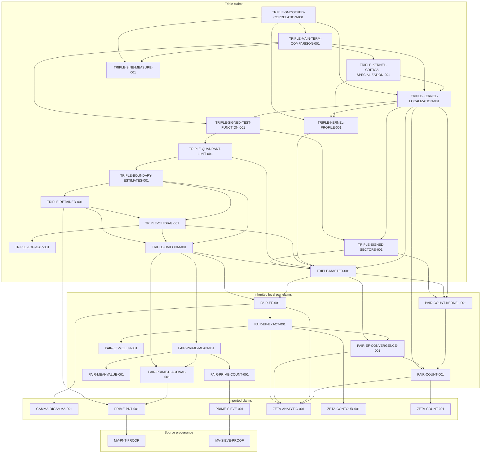

# Assembled triple theorem: complete recorded dependency graph

Task: exposition and finite bookkeeping verification. Assumptions for this
inventory: `UNCONDITIONAL`; individual claim assumptions, including support
restrictions, are reproduced verbatim below. Snapshot date: **2026-10-03**.
Root: **TRIPLE-SMOOTHED-CORRELATION-001**.
Authority: [the theorem ledger](theorem-ledger.yaml).

This is the complete closure of the root's recorded `dependencies` edges:
**31 claims** (15 triple, ten inherited local pair, six imported),
**two source-provenance nodes**, and **58 edges** (56 claim-to-claim and
two claim-to-provenance). The [JSON snapshot](triple-dependency-graph.json)
and [checker](../scripts/check_triple_dependencies.py) accompany this report.
The [assembled theorem](triple-theorem.md) remains **proved-draft**.

## Scope and graph conventions

An arrow `A --> B` means “A uses B.” The diagram and inventories contain
all recorded edges, including redundant direct edges. This is not a claim
that the graph is minimal, nor a reconstruction of every imported theorem's
upstream proof. Source nodes are provenance locators, not additional claims.
Only `dependencies` are traversed. Bibliographic comparisons, `local_claim`,
`definitions_from`, and other reconstruction/context links are not edges.

No theorem status, assumption, computation flag, completeness flag, or
existing audit record is changed by this inventory. In particular,
`dependency_graph_complete: false` remains false where recorded. The graph
is complete as an inventory of recorded premises; it is not an analytic
proof certificate or an RH-contamination verdict.

### Complete graph

<!-- triple-dependencies:graph:start -->

<!-- triple-dependencies:graph:end -->

## Complete claim inventories

The assumption column preserves the complete ledger field, including
quoted support descriptions. These are claim-specific hypotheses rather
than a union of every support condition imposed on the root. The proof
transports the positive-quadrant statements to signed sectors before
applying them on the root's open hexagon. File links give stable LaTeX
labels; the checker verifies that each label exists.

### Triple claims

<!-- triple-dependencies:triple:start -->
| Claim | Role | Direct dependencies | Status | Assumptions (verbatim ledger field) | Proof locator |
| --- | --- | --- | --- | --- | --- |
| `TRIPLE-BOUNDARY-ESTIMATES-001` | Local boundary profiles and integrated positive-quadrant error budget | `TRIPLE-UNIFORM-001`, `TRIPLE-OFFDIAG-001`, `TRIPLE-RETAINED-001` | `proved-draft` | `[UNCONDITIONAL, "SUPPORT(relative support in xi>=0, eta>=0, xi+eta<=1-kappa; 0<kappa<1)"]` | [lem:triple-boundary-estimates](../proofs/triple_explicit_formula.tex) |
| `TRIPLE-KERNEL-CRITICAL-SPECIALIZATION-001` | Microscopic horizontal profile and isolated critical-line specialization | `TRIPLE-KERNEL-PROFILE-001`, `TRIPLE-KERNEL-LOCALIZATION-001` | `proved-draft` | `[UNCONDITIONAL]` | [cor:triple-kernel-critical](../proofs/triple_explicit_formula.tex) |
| `TRIPLE-KERNEL-LOCALIZATION-001` | Summable height-localization error and explicit-profile correlation | `TRIPLE-KERNEL-PROFILE-001`, `TRIPLE-MASTER-001`, `PAIR-COUNT-001`, `PAIR-COUNT-KERNEL-001`, `TRIPLE-SIGNED-SECTORS-001`, `TRIPLE-SIGNED-TEST-FUNCTION-001` | `proved-draft` | `[UNCONDITIONAL, "SUPPORT(h<=1-kappa, 0<kappa<1; correlation consequence only)"]` | [lem:triple-kernel-localization](../proofs/triple_explicit_formula.tex) |
| `TRIPLE-KERNEL-PROFILE-001` | Exact rational triple-kernel profile with full horizontal parameters | `TRIPLE-MASTER-001` | `proved-draft` | `[UNCONDITIONAL]` | [lem:triple-kernel-profile](../proofs/triple_explicit_formula.tex) |
| `TRIPLE-LOG-GAP-001` | Absolute logarithmic-gap bound for integer frequencies | None recorded | `proved-draft` | `[UNCONDITIONAL]` | [lem:triple-log-gap](../proofs/triple_explicit_formula.tex) |
| `TRIPLE-MAIN-TERM-COMPARISON-001` | Exact sine-benchmark identification of the weighted triple main term | `TRIPLE-SINE-MEASURE-001`, `TRIPLE-SIGNED-TEST-FUNCTION-001`, `TRIPLE-KERNEL-LOCALIZATION-001`, `TRIPLE-KERNEL-CRITICAL-SPECIALIZATION-001` | `proved-draft` | `[UNCONDITIONAL, "SUPPORT(h<=1-kappa, 0<kappa<1)"]` | [lem:triple-main-term-comparison](../proofs/triple_explicit_formula.tex) |
| `TRIPLE-MASTER-001` | Exact smoothed triple master identity with full zero coordinates | `PAIR-EF-CONVERGENCE-001`, `PAIR-EF-001`, `PAIR-COUNT-KERNEL-001` | `proved-draft` | `[UNCONDITIONAL]` | [lem:triple-master](../proofs/triple_explicit_formula.tex) |
| `TRIPLE-OFFDIAG-001` | Decaying mixed-prime and cubic off-diagonal bounds | `TRIPLE-LOG-GAP-001`, `TRIPLE-UNIFORM-001`, `TRIPLE-MASTER-001` | `proved-draft` | `[UNCONDITIONAL]` | [lem:triple-offdiag](../proofs/triple_explicit_formula.tex) |
| `TRIPLE-QUADRANT-LIMIT-001` | One-sided axis and origin limit for the native weighted triple correlation | `TRIPLE-BOUNDARY-ESTIMATES-001`, `TRIPLE-MASTER-001` | `proved-draft` | `[UNCONDITIONAL, "SUPPORT(relative support in xi>=0, eta>=0, xi+eta<=1-kappa; 0<kappa<1)"]` | [thm:triple-quadrant-limit](../proofs/triple_explicit_formula.tex) |
| `TRIPLE-RETAINED-001` | Evaluation and bounds for the retained triple terms | `TRIPLE-UNIFORM-001`, `TRIPLE-OFFDIAG-001`, `PRIME-PNT-001` | `proved-draft` | `[UNCONDITIONAL]` | [lem:triple-retained](../proofs/triple_explicit_formula.tex) |
| `TRIPLE-SIGNED-SECTORS-001` | Reciprocal full-zero reflection and six signed frequency sectors | `TRIPLE-MASTER-001`, `PAIR-COUNT-KERNEL-001` | `proved-draft` | `[UNCONDITIONAL]` | [lem:triple-signed-sectors](../proofs/triple_explicit_formula.tex) |
| `TRIPLE-SIGNED-TEST-FUNCTION-001` | Native weighted full-zero Schwartz correlation with hexagonal Fourier support | `TRIPLE-SIGNED-SECTORS-001`, `TRIPLE-QUADRANT-LIMIT-001` | `proved-draft` | `[UNCONDITIONAL, "SUPPORT(compact subset of max(abs(xi),abs(eta),abs(xi+eta))<1)"]` | [thm:triple-signed-test-function](../proofs/triple_explicit_formula.tex) |
| `TRIPLE-SINE-MEASURE-001` | All-ordered sine measure and its third-cumulant Fourier cancellation | None recorded | `proved-draft` | `[UNCONDITIONAL]` | [lem:triple-sine-measure](../proofs/triple_explicit_formula.tex) |
| `TRIPLE-SMOOTHED-CORRELATION-001` | Unconditional smoothed weighted three-level correlation in unit sine-benchmark normalization | `TRIPLE-KERNEL-PROFILE-001`, `TRIPLE-KERNEL-LOCALIZATION-001`, `TRIPLE-SINE-MEASURE-001`, `TRIPLE-MAIN-TERM-COMPARISON-001` | `proved-draft` | `[UNCONDITIONAL, "SUPPORT(h<=1-kappa, 0<kappa<1)"]` | [thm:triple-smoothed-correlation](../proofs/triple_explicit_formula.tex) |
| `TRIPLE-UNIFORM-001` | Uniform smoothed triple bounds and a named signed error budget | `TRIPLE-MASTER-001`, `PAIR-EF-001`, `PAIR-PRIME-MEAN-001`, `PAIR-PRIME-DIAGONAL-001` | `proved-draft` | `[UNCONDITIONAL]` | [lem:triple-uniform](../proofs/triple_explicit_formula.tex) |
<!-- triple-dependencies:triple:end -->

### Inherited local pair claims

<!-- triple-dependencies:pair_local:start -->
| Claim | Role | Direct dependencies | Status | Assumptions (verbatim ledger field) | Proof locator |
| --- | --- | --- | --- | --- | --- |
| `PAIR-COUNT-001` | Inclusive and local zero counts with full endpoint multiplicities | `ZETA-COUNT-001`, `ZETA-ANALYTIC-001` | `proved-draft` | `[UNCONDITIONAL]` | [lem:pair-count](../proofs/pair_baseline.tex) |
| `PAIR-COUNT-KERNEL-001` | Global, distant and boundary rational-kernel estimates from local counts | `PAIR-COUNT-001` | `proved-draft` | `[UNCONDITIONAL]` | [lem:count-kernel](../proofs/pair_baseline.tex) |
| `PAIR-EF-001` | Reconstructed unconditional BGSTB Lemma 1 with named uniform remainders | `PAIR-EF-EXACT-001`, `ZETA-ANALYTIC-001`, `GAMMA-DIGAMMA-001` | `proved-draft` | `[UNCONDITIONAL]` | [lem:pair-ef](../proofs/pair_baseline.tex) |
| `PAIR-EF-CONVERGENCE-001` | Absolute and local uniform convergence of the paired zero and prime series | `ZETA-ANALYTIC-001`, `PAIR-COUNT-001` | `proved-draft` | `[UNCONDITIONAL]` | [lem:ef-convergence](../proofs/pair_baseline.tex) |
| `PAIR-EF-EXACT-001` | Exact full-zero explicit formula with continuous endpoint conventions | `ZETA-ANALYTIC-001`, `ZETA-CONTOUR-001`, `PAIR-EF-CONVERGENCE-001`, `PAIR-EF-MELLIN-001` | `proved-draft` | `[UNCONDITIONAL]` | [prop:ef-exact](../proofs/pair_baseline.tex) |
| `PAIR-EF-MELLIN-001` | Absolutely convergent paired Mellin kernel including its endpoint | None recorded | `proved-draft` | `[UNCONDITIONAL]` | [lem:ef-mellin](../proofs/pair_baseline.tex) |
| `PAIR-MEANVALUE-001` | Fourier mean-value bound with a strict nearby-frequency cutoff | None recorded | `proved-draft` | `[UNCONDITIONAL]` | [lem:pair-meanvalue](../proofs/pair_baseline.tex) |
| `PAIR-PRIME-COUNT-001` | Averaged von Mangoldt pair counts and weighted nearby frequencies | `PRIME-SIEVE-001` | `proved-draft` | `[UNCONDITIONAL]` | [lem:prime-count](../proofs/pair_baseline.tex) |
| `PAIR-PRIME-DIAGONAL-001` | Weighted diagonal with proper prime powers and inclusive cutoffs | `PRIME-PNT-001` | `proved-draft` | `[UNCONDITIONAL]` | [lem:prime-diagonal](../proofs/pair_baseline.tex) |
| `PAIR-PRIME-MEAN-001` | Weighted prime-series mean square through X=T | `PAIR-MEANVALUE-001`, `PAIR-PRIME-COUNT-001`, `PAIR-PRIME-DIAGONAL-001` | `proved-draft` | `[UNCONDITIONAL]` | [lem:prime-mean](../proofs/pair_baseline.tex) |
<!-- triple-dependencies:pair_local:end -->

### Imported claims

<!-- triple-dependencies:imported:start -->
| Claim | Role | Direct dependencies | Status | Assumptions (verbatim ledger field) | Proof locator |
| --- | --- | --- | --- | --- | --- |
| `GAMMA-DIGAMMA-001` | Uniform digamma approximation in a fixed sector | None recorded | `published` | `[UNCONDITIONAL]` | [sec:analytic-inputs](../proofs/pair_baseline.tex) |
| `PRIME-PNT-001` | Effective classical prime number theorem | `MV-PNT-PROOF` | `published` | `[UNCONDITIONAL]` | [inp:prime-pnt](../proofs/pair_baseline.tex) |
| `PRIME-SIEVE-001` | Uniform upper bound for prime pairs with even shift | `MV-SIEVE-PROOF` | `published` | `[UNCONDITIONAL]` | [inp:prime-sieve](../proofs/pair_baseline.tex) |
| `ZETA-ANALYTIC-001` | Classical analytic structure and functional equation of zeta | None recorded | `published` | `[UNCONDITIONAL]` | [sec:analytic-inputs](../proofs/pair_baseline.tex) |
| `ZETA-CONTOUR-001` | Unconditional logarithmic-derivative estimates for contour shifts | None recorded | `published` | `[UNCONDITIONAL]` | [sec:analytic-inputs](../proofs/pair_baseline.tex) |
| `ZETA-COUNT-001` | Riemann-von Mangoldt count with midpoint endpoint convention | None recorded | `published` | `[UNCONDITIONAL]` | [sec:analytic-inputs](../proofs/pair_baseline.tex) |
<!-- triple-dependencies:imported:end -->

### Effectivity, interchanges, completeness, and computation

All 31 claims record effective constants and no computation used in their
proofs. Exact regression checks are verification, not numerical proof
inputs. Twenty-six claims record justified interchanges; five imported
claims have `null`, retained as unknown rather than converted to true or
false. The certificate hashes in the snapshot are null.

<!-- triple-dependencies:flags:start -->
| Claim | Effective constants | Interchanges justified | Dependency completeness | Computation in proof |
| --- | --- | --- | --- | --- |
| `GAMMA-DIGAMMA-001` | true | null (unrecorded/unknown) | false | false |
| `PAIR-COUNT-001` | true | true | false | false |
| `PAIR-COUNT-KERNEL-001` | true | true | false | false |
| `PAIR-EF-001` | true | true | false | false |
| `PAIR-EF-CONVERGENCE-001` | true | true | false | false |
| `PAIR-EF-EXACT-001` | true | true | false | false |
| `PAIR-EF-MELLIN-001` | true | true | true | false |
| `PAIR-MEANVALUE-001` | true | true | true | false |
| `PAIR-PRIME-COUNT-001` | true | true | false | false |
| `PAIR-PRIME-DIAGONAL-001` | true | true | false | false |
| `PAIR-PRIME-MEAN-001` | true | true | false | false |
| `PRIME-PNT-001` | true | null (unrecorded/unknown) | false | false |
| `PRIME-SIEVE-001` | true | null (unrecorded/unknown) | false | false |
| `TRIPLE-BOUNDARY-ESTIMATES-001` | true | true | false | false |
| `TRIPLE-KERNEL-CRITICAL-SPECIALIZATION-001` | true | true | false | false |
| `TRIPLE-KERNEL-LOCALIZATION-001` | true | true | false | false |
| `TRIPLE-KERNEL-PROFILE-001` | true | true | false | false |
| `TRIPLE-LOG-GAP-001` | true | true | true | false |
| `TRIPLE-MAIN-TERM-COMPARISON-001` | true | true | false | false |
| `TRIPLE-MASTER-001` | true | true | false | false |
| `TRIPLE-OFFDIAG-001` | true | true | false | false |
| `TRIPLE-QUADRANT-LIMIT-001` | true | true | false | false |
| `TRIPLE-RETAINED-001` | true | true | false | false |
| `TRIPLE-SIGNED-SECTORS-001` | true | true | false | false |
| `TRIPLE-SIGNED-TEST-FUNCTION-001` | true | true | false | false |
| `TRIPLE-SINE-MEASURE-001` | true | true | true | false |
| `TRIPLE-SMOOTHED-CORRELATION-001` | true | true | false | false |
| `TRIPLE-UNIFORM-001` | true | true | false | false |
| `ZETA-ANALYTIC-001` | true | true | false | false |
| `ZETA-CONTOUR-001` | true | null (unrecorded/unknown) | false | false |
| `ZETA-COUNT-001` | true | null (unrecorded/unknown) | false | false |
<!-- triple-dependencies:flags:end -->

## Convergence, support, and uniformity map

This table identifies where to inspect each analytic obligation. It
summarizes existing statements and proofs rather than supplying a new
passage-level audit.

| Obligation | Claims and proof location in the inventories | Scope and justification recorded in the proof |
| --- | --- | --- |
| Zeta analytic identities, contour heights, gamma-factor estimates | `ZETA-ANALYTIC-001`, `ZETA-CONTOUR-001`, `GAMMA-DIGAMMA-001`, `PAIR-EF-EXACT-001`, `PAIR-EF-001` | Euler-series convergence, admissible contour heights, fixed-sector digamma bounds; named remainders uniform for `X>=1` and real `t` |
| Counting and global kernel majorants | `ZETA-COUNT-001`, `PAIR-COUNT-001`, `PAIR-COUNT-KERNEL-001` | Translate midpoint counts to inclusive occurrence counts; local and shell estimates retain multiplicities and both ordinate signs |
| Paired explicit-formula convergence | `PAIR-EF-CONVERGENCE-001`, `PAIR-EF-MELLIN-001`, `PAIR-EF-EXACT-001` | Absolute/local uniform series bounds; remove contour and zero cutoffs in the recorded order; endpoint `X=1` follows by domination |
| Triple zero and prime expansions | `TRIPLE-MASTER-001` | Integrable product-kernel majorant and absolute coefficient sums at fixed `T,X,Y,omega`; independent cutoffs and all five index partitions permitted |
| Mean values and weighted arithmetic sums | `PAIR-MEANVALUE-001`, `PAIR-PRIME-COUNT-001`, `PAIR-PRIME-DIAGONAL-001`, `PAIR-PRIME-MEAN-001`, `TRIPLE-UNIFORM-001` | Strict nearby-frequency cutoff, uniform prime-pair upper bounds, inclusive prime-power diagonal, and separate smoothing norms; use each bound only in its stated parameter range |
| Mixed and cubic off-diagonal terms | `TRIPLE-LOG-GAP-001`, `TRIPLE-OFFDIAG-001` | Finite reciprocal-log majorants, monotone convergence, absolute convolutions; integration by parts differentiates the smooth weight |
| Retained terms | `TRIPLE-RETAINED-001` | PNT-level partial summation, vanishing endpoint terms and summable dyadic tails; no prime-pair/triple asymptotic imported |
| Positive axes and origin | `TRIPLE-BOUNDARY-ESTIMATES-001`, `TRIPLE-QUADRANT-LIMIT-001` | Integrated bounds valid up to the positive axes, relative support `xi,eta>=0`, `xi+eta<=1-kappa`; fix smoothing and margin before the height limit |
| Signed sectors and complex Fourier tests | `TRIPLE-SIGNED-SECTORS-001`, `TRIPLE-SIGNED-TEST-FUNCTION-001` | Absolute convergence permits full-occurrence reflection/reindexing; six determinant-one maps cover the sectors; horizontal test majorant retains `B^(1-kappa)` |
| Full-gap profile and height localization | `TRIPLE-KERNEL-PROFILE-001`, `TRIPLE-KERNEL-LOCALIZATION-001` | Residues extended to collisions by domination; near/far shell bounds prove a summed error before removing zero cutoffs; derivative sup norm kept distinct from derivative L1 norm |
| Microscopic parameter specialization | `TRIPLE-KERNEL-CRITICAL-SPECIALIZATION-001` | Uniform compact-gap expansion at fixed scaled radius; the kernel can be evaluated at zero deltas without asserting every zero lies on the line |
| Sine benchmark and normalization | `TRIPLE-SINE-MEASURE-001`, `TRIPLE-MAIN-TERM-COMPARISON-001` | Schwartz-test distributional Fubini and five index partitions; bilinear Fourier pairing; exact limiting factor `3/2`; no new zero-sum interchange |
| Final assembled theorem | `TRIPLE-SMOOTHED-CORRELATION-001` | Exact normalization `(2/3)A_T^J`; absolute convergence first, then fixed test/margin/smoothing as `T` grows; both named errors retained |

The root's domain is `T>=2pi e` and support in `h<=1-kappa`, with
`0<kappa<1`. The internal axes and origin are included, while the outer
boundary `h=1` is excluded. Smoothing is real, nonnegative, compactly
supported in `(1,2)`, and has integral one. The benchmark's cancellation
on `h=1` does not extend the zero-statistic estimate to that boundary.

### Exact recorded limit orders

Missing limit-order fields are shown as unrecorded/unknown; their absence
is not evidence that an upstream argument has no limiting operations.

<!-- triple-dependencies:limits:start -->
| Claim | Recorded limit order |
| --- | --- |
| `GAMMA-DIGAMMA-001` | null (unrecorded/unknown) |
| `PAIR-COUNT-001` | Endpoint translations are finite sandwiches; v->infinity only for the stated count asymptotic. |
| `PAIR-COUNT-KERNEL-001` | Fixed parameters; nonnegative shell sums are justified by monotone convergence and summable majorants. |
| `PAIR-EF-001` | Uses the exact identity after all contours are removed; estimates uniform for X>=1,t real. |
| `PAIR-EF-CONVERGENCE-001` | Zero cutoff U -> infinity, locally uniformly in (X,t); absolute prime series. |
| `PAIR-EF-EXACT-001` | Fixed X>1,t,M; U_j -> infinity; M -> infinity; finally X down to 1 by local domination. |
| `PAIR-EF-MELLIN-001` | Horizontal heights -> infinity at fixed shifted line; then real boundary -> infinity. |
| `PAIR-MEANVALUE-001` | Fixed T,delta; absolute coefficient summability permits Fubini and finite-sum approximation. |
| `PAIR-PRIME-COUNT-001` | Finite U,V first; singular-factor expansion and dyadic tails use nonnegative convergent majorants. |
| `PAIR-PRIME-DIAGONAL-001` | Partial summation on finite intervals, then upper endpoint to infinity at fixed X; integrable derivative and dyadic tail bounds. |
| `PAIR-PRIME-MEAN-001` | Prime-series tails vanish uniformly in t at fixed X,T; resulting estimates are uniform on 1<=X<=T. |
| `PRIME-PNT-001` | Imported pointwise bounds for every u>=2; upstream interchange audit incomplete. |
| `PRIME-SIEVE-001` | Uniform imported upper bound; no local limiting operation. |
| `TRIPLE-BOUNDARY-ESTIMATES-001` | Convergent zero/prime expressions at fixed parameters first; then fix smoothing and compact profile ranges before T tends to infinity. Integrated estimate is uniform in kappa and the stated test class. |
| `TRIPLE-KERNEL-CRITICAL-SPECIALIZATION-001` | Fix the scaled-gap bound R before T tends to infinity; the horizontal parameters may vary arbitrarily within the closed cube. No microscopic limit is interchanged with an infinite zero sum. |
| `TRIPLE-KERNEL-LOCALIZATION-001` | Tonelli for nonnegative error majorants at fixed T and smoothing; unit and dyadic shell bounds prove finiteness before zero cutoffs are removed. For the correlation limit fix test, support margin and smoothing; varying families must make both errors vanish. |
| `TRIPLE-KERNEL-PROFILE-001` | Residues for distinct centers at fixed parameters; then dominated convergence on compact gap sets extends to center collisions and horizontal endpoints. |
| `TRIPLE-LOG-GAP-001` | Prove the bound for finite independent sequence truncations, then use monotone convergence on all nonnegative sums. |
| `TRIPLE-MAIN-TERM-COMPARISON-001` | Fix test, support margin and smoothing before T tends to infinity. Varying families must make both retained errors vanish; no new zero-sum interchange is used. |
| `TRIPLE-MASTER-001` | Fix T,X,Y,omega; remove the three zero cutoffs independently or jointly by the integrable kernel majorant; prime cutoffs by absolute convergence. No asymptotic or varying-smoothing limit is taken. |
| `TRIPLE-OFFDIAG-001` | Fixed parameters; absolute coefficient sums justify convolution and integrals; finite reciprocal-log majorants justify removal of off-diagonal cutoffs. Only the smooth weights are differentiated. |
| `TRIPLE-QUADRANT-LIMIT-001` | At fixed T,psi,omega remove independent zero cutoffs under the explicit absolute majorant. Then fix psi,kappa,omega and let T tend to infinity. Varying families require the displayed bound to vanish. |
| `TRIPLE-RETAINED-001` | Fixed parameters before Stieltjes upper endpoints and nonnegative dyadic sums tend to infinity; explicit summable majorants and vanishing boundary terms. |
| `TRIPLE-SIGNED-SECTORS-001` | All series products, conjugations and reindexings are at fixed parameters under absolute majorants; convergence is locally uniform in x>0,t real. No asymptotic limit is used. |
| `TRIPLE-SIGNED-TEST-FUNCTION-001` | Remove independent zero cutoffs at fixed T,phi,omega under C&#124;&#124;phi&#124;&#124;_1 B^(1-kappa)L^3. Then fix phi,kappa,omega and let T grow; varying families require the displayed error to vanish. |
| `TRIPLE-SINE-MEASURE-001` | No asymptotic limit. Compact interval parameter integrals are exchanged against Schwartz tests under an integrable absolute majorant; all measure pairings converge absolutely. |
| `TRIPLE-SMOOTHED-CORRELATION-001` | At fixed T,test,smoothing, absolute convergence permits arbitrary independent zero-cutoff limits. Then fix test, support margin and smoothing before T tends to infinity; varying families must make both named errors vanish. |
| `TRIPLE-UNIFORM-001` | Fixed T,X,Y,omega before removing absolutely convergent cutoffs; integration by parts acts only on compact smooth weights. No asymptotic or shrinking-width limit. |
| `ZETA-ANALYTIC-001` | null (unrecorded/unknown) |
| `ZETA-CONTOUR-001` | null (unrecorded/unknown) |
| `ZETA-COUNT-001` | null (unrecorded/unknown) |
<!-- triple-dependencies:limits:end -->

## Primary-source provenance and existing review status

These entries summarize the source records already in the ledger and the
Work Package A audit. **No fresh external literature review was performed
for this inventory.** The primary-source links are recorded provenance.
The current [Work Package A closure checklist](work-package-a-closure.md)
explains which historical follow-ups are nonblocking; this graph introduces
no new independent-review or publisher-version requirement.

<!-- triple-dependencies:imported_sources:start -->
| Imported claim | Primary-source locator | Existing source-review record |
| --- | --- | --- |
| `GAMMA-DIGAMMA-001` | [MV2007](https://personal.science.psu.edu/rcv4/personal/Publications/MNTI/20.3_pp_520_534_The_gamma_function.pdf) — Appendix C, Theorem C.1, equation (C.17), p.523 and proof pp.523-524 | task_type: source_verification<br/>      statement_checked: "2026-09-25"<br/>      scope: "Uses a fixed sector; numerical optimization of the effective constant is not attempted."<br/>      independent_verification: pending |
| `PRIME-PNT-001` | [MV2007](https://personal.science.psu.edu/rcv4/personal/Publications/MNTI/10.0_pp_168_198_The_Prime_Number_Theorem.pdf) — Theorem 6.9, equations (6.12)-(6.13), p. 179; proof pp. 180-181 | task_type: source_verification<br/>      statement_checked: "2026-09-26"<br/>      proof_structure_audit: "Classical zero-free region, Perron truncation and contour shift; effective constants, no unproved RH or computational verification."<br/>      proof_reconstruction: not_attempted<br/>      independent_verification: pending |
| `PRIME-SIEVE-001` | [MV2007](https://personal.science.psu.edu/rcv4/personal/Publications/MNTI/07.0_pp_76_107_Principles_and_first_examples_of_sieve_methods.pdf) — Corollary 3.14, p. 97, specialized to x=0,y=U; fixed product and bounded error factor absorbed | task_type: source_verification<br/>      statement_checked: "2026-09-26"<br/>      uniformity_audit: "Source explicitly uniform in the nonzero even shift; elementary sieve constants effective."<br/>      proof_reconstruction: not_attempted<br/>      independent_verification: pending |
| `ZETA-ANALYTIC-001` | [DLMF](https://dlmf.nist.gov/25.4#E2) — Sections 25.2(i), 25.2(iv), 25.10(i); equation (25.4.2) | task_type: source_verification<br/>      statement_checked: "2026-09-25"<br/>      scope: "Standard analytic input; Euler-product differentiation justified in the draft."<br/>      foundational_reconstruction: not_attempted<br/>      independent_verification: pending |
| `ZETA-CONTOUR-001` | [MV2007](https://personal.science.psu.edu/rcv4/personal/Publications/MNTI/16.0_pp_397_418_Explicit_formulae.pdf) — Chapter 12, Lemma 12.2 p.398 and Lemma 12.4 pp.399-400 | task_type: source_verification<br/>      statement_checked: "2026-09-25"<br/>      scope: "Statements and displayed proofs read; foundational dependency reconstruction not claimed."<br/>      rh_contamination_audit: "Neither imported lemma assumes RH or simplicity."<br/>      independent_verification: pending |
| `ZETA-COUNT-001` | [MV2007](https://personal.science.psu.edu/rcv4/personal/Publications/MNTI/18.0_pp_452_462_Zeros.pdf) — Chapter 14, definition p.452 and Corollary 14.3 p.454 | task_type: source_verification<br/>      statement_checked: "2026-09-25"<br/>      scope: "Published unconditional input; full upstream proof not reconstructed."<br/>      endpoint_translation: "Inclusive count and local count obtained by sandwiching in the draft."<br/>      rh_contamination_audit: "Corollary 14.4 (RH) is excluded."<br/>      independent_verification: pending |
<!-- triple-dependencies:imported_sources:end -->

### Provenance nodes reached by dependency edges

<!-- triple-dependencies:sources:start -->
| Source pointer | Reached from | Bibliography / version | Locator | Recorded review status and scope |
| --- | --- | --- | --- | --- |
| `MV-PNT-PROOF` | `PRIME-PNT-001` | `MV2007` / `author_hosted_publisher_chapter` | Chapter 6, Theorem 6.9, pp. 179-181; classical zero-free-region inputs in Section 6.1 | `statement_and_proof_structure_checked`; Unconditional effective PNT; statement and proof structure checked, upstream proof not fully reconstructed. No numerical proof input or modern computational KV theorem is used. |
| `MV-SIEVE-PROOF` | `PRIME-SIEVE-001` | `MV2007` / `author_hosted_publisher_chapter` | Chapter 3, Corollary 3.14, p. 97; Theorem 3.10, Lemma 3.12 and Theorem 3.13 | `statement_and_proof_structure_checked`; Unconditional elementary upper-bound sieve, uniform in the even nonzero shift. Effectivity follows from the displayed sieve construction; upstream proof not fully reconstructed. |
<!-- triple-dependencies:sources:end -->

The PNT uses its classical zero-free-region input as described in its
source record. This is distinct from importing the project's modern
computational `ZETA-KV-001` theorem. The upper-bound sieve supplies a
uniform inequality, not a conjectural prime-pair asymptotic.

## Inherited Work Package A audit coverage

Exactly **16 claims** in this closure have snapshots and passage references
in the [existing pair audit](pair-rh-audit.md), recorded on **2026-09-28**.
The checker validates the existing audit's source hashes and metadata
before matching this intersection. The following references describe that
existing scope only; a passage may discuss several claims or compare an
input with another branch.

<!-- triple-dependencies:coverage:start -->
| Inherited claim | Existing audit passages (file: ID) | Coverage scope |
| --- | --- | --- |
| `GAMMA-DIGAMMA-001` | proofs/pair_baseline.tex: P008 | Existing Work Package A review only |
| `PAIR-COUNT-001` | proofs/pair_baseline.tex: P013; proofs/pair_baseline.tex: P014; proofs/pair_baseline.tex: P015; proofs/pair_baseline.tex: P016 | Existing Work Package A review only |
| `PAIR-COUNT-KERNEL-001` | proofs/pair_baseline.tex: P017; proofs/pair_baseline.tex: P018; proofs/pair_baseline.tex: P019; proofs/pair_baseline.tex: P020; proofs/pair_baseline.tex: P021 | Existing Work Package A review only |
| `PAIR-EF-001` | proofs/pair_baseline.tex: P002; proofs/pair_baseline.tex: P003; proofs/pair_baseline.tex: P036; proofs/pair_baseline.tex: P037; proofs/pair_baseline.tex: P038; proofs/pair_baseline.tex: P039; proofs/pair_baseline.tex: P040; proofs/pair_baseline.tex: P041; proofs/pair_baseline.tex: P107; proofs/pair_baseline.tex: P108; scripts/check_pair_lemma1.py: C001 | Existing Work Package A review only |
| `PAIR-EF-CONVERGENCE-001` | proofs/pair_baseline.tex: P003; proofs/pair_baseline.tex: P022; proofs/pair_baseline.tex: P023; proofs/pair_baseline.tex: P024 | Existing Work Package A review only |
| `PAIR-EF-EXACT-001` | proofs/pair_baseline.tex: P027; proofs/pair_baseline.tex: P028; proofs/pair_baseline.tex: P029; proofs/pair_baseline.tex: P030; proofs/pair_baseline.tex: P031; proofs/pair_baseline.tex: P032; proofs/pair_baseline.tex: P033; proofs/pair_baseline.tex: P034; proofs/pair_baseline.tex: P035; proofs/pair_baseline.tex: P109 | Existing Work Package A review only |
| `PAIR-EF-MELLIN-001` | proofs/pair_baseline.tex: P025; proofs/pair_baseline.tex: P026 | Existing Work Package A review only |
| `PAIR-MEANVALUE-001` | proofs/pair_baseline.tex: P072; proofs/pair_baseline.tex: P073; proofs/pair_baseline.tex: P074; proofs/pair_baseline.tex: P075; proofs/pair_baseline.tex: P076; proofs/pair_baseline.tex: P077 | Existing Work Package A review only |
| `PAIR-PRIME-COUNT-001` | proofs/pair_baseline.tex: P078; proofs/pair_baseline.tex: P079; proofs/pair_baseline.tex: P080; proofs/pair_baseline.tex: P081; proofs/pair_baseline.tex: P082; proofs/pair_baseline.tex: P083 | Existing Work Package A review only |
| `PAIR-PRIME-DIAGONAL-001` | proofs/pair_baseline.tex: P078; proofs/pair_baseline.tex: P084; proofs/pair_baseline.tex: P085; proofs/pair_baseline.tex: P086; proofs/pair_baseline.tex: P087 | Existing Work Package A review only |
| `PAIR-PRIME-MEAN-001` | proofs/pair_baseline.tex: P088; proofs/pair_baseline.tex: P089; proofs/pair_baseline.tex: P090; proofs/pair_baseline.tex: P091 | Existing Work Package A review only |
| `PRIME-PNT-001` | proofs/pair_baseline.tex: P011 | Existing Work Package A review only |
| `PRIME-SIEVE-001` | proofs/pair_baseline.tex: P012 | Existing Work Package A review only |
| `ZETA-ANALYTIC-001` | proofs/pair_baseline.tex: P004; proofs/pair_baseline.tex: P005 | Existing Work Package A review only |
| `ZETA-CONTOUR-001` | proofs/pair_baseline.tex: P007 | Existing Work Package A review only |
| `ZETA-COUNT-001` | proofs/pair_baseline.tex: P006 | Existing Work Package A review only |
<!-- triple-dependencies:coverage:end -->

The remaining **15 triple claims** have no coverage in that pair audit.
Their local assumption and convergence records support navigation for the
forthcoming Work Package B review; they do not establish a new line-by-line
RH-contamination verdict. The old audit is neither independent review nor
an analytic proof certificate, and this inventory does not change that.

## Contextual references and excluded branches

- `PAIR-ASYMPTOTIC-001`, `PAIR-COMPARE-001`, `PAIR-ENVELOPE-001`,
  `ZETA-KV-001`, and `ZETA-LOW-001` are outside this closure. Neither the
  final pair asymptotic nor its computational zero-free-region/finite-height
  verification chain is a recorded premise of the triple theorem.
- `PAIR-BGSTB-001` and the `BGSTB-*` source pointers are comparison and
  reconstruction context. They are not reached by this root's dependency
  edges. The required pair lemmas have their own local proof branches.
- The Conrey–Snaith source in `TRIPLE-SINE-MEASURE-001` fixes the benchmark
  convention; the sine identities are proved locally. The
  [source note](literature-notes/triple-sine-comparison.md) explicitly imports
  no external zeta correlation theorem. Its citation is preserved in the
  snapshot without adding a theorem-premise edge.
- `TRIPLE-KERNEL-CRITICAL-SPECIALIZATION-001` **is** in the recorded closure,
  through `TRIPLE-MAIN-TERM-COMPARISON-001`. Its role there is the local
  normalization discussion. It is an unconditional parameter specialization.
  Applying that specialization to all zero tuples would use RH, and that
  separate conditional interpretation is not an input to the assembled
  theorem. This inventory preserves the ledger edge rather than pruning it.

### Earlier triple results outside the root closure

These historical intermediate results remain in the ledger and manuscript,
but are not premises in this root's recorded dependency chain. The broader
signed-test proof follows the boundary/quadrant route instead.

<!-- triple-dependencies:outside:start -->
| Earlier triple claim outside this dependency closure |
| --- |
| `TRIPLE-INTERIOR-VANISHING-001` |
| `TRIPLE-SMOOTHED-ADDITIVE-001` |
| `TRIPLE-TEST-FUNCTION-001` |
<!-- triple-dependencies:outside:end -->

## Verification and next step

Run the [checker](../scripts/check_triple_dependencies.py) directly or via
the standard triple suite:

```bash
python3 -B scripts/check_triple_dependencies.py
python3 -B -m unittest discover -s scripts -p 'check_triple_*.py'
python3 -B -m unittest discover -s scripts -p 'check_pair_*.py'
```

The JSON stores typed nodes, ledger block hashes, exact assumption fields,
proof/source locators, recorded audit metadata, dependency edges and inherited
passage IDs. The checker derives the closure afresh from the ledger and
compares it with the JSON and marked report sections. It checks proof labels,
bibliography keys and local links, and rejects missing/extra/duplicate nodes
or edges, stale metadata, unknown dependencies, cycles and false audit coverage.
The report prose remains an authored interpretation, not mechanically
verified mathematics.

This completes the root's **recorded dependency inventory**. Next comes the
line-by-line Work Package B RH-contamination audit, then the clean-checkout
reproduction harness. Kernel removal and horizontal consequences remain
separate extensions of the current weighted theorem.

Validation on **2026-10-03**: all **89 triple checks** (including seven new
dependency checks) and **70 pair checks** passed. All 33 nodes and 58 edges
agree across the ledger, JSON snapshot, inventories and Mermaid graph;
all 16 inherited audit-coverage entries have existing passage references.
Whitespace checks passed. The theorem ledger, proof manuscripts and pair
RH-audit records were not modified; no proof rebuild was needed for this
documentation and bookkeeping change.
