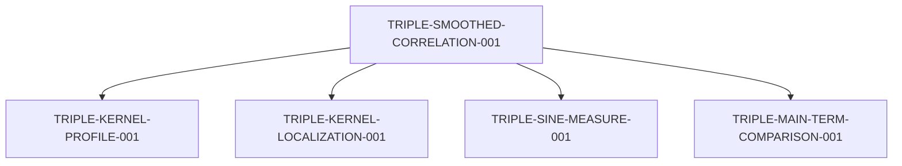

# Unconditional smoothed weighted three-level theorem

Task: proof synthesis and exposition. Claim **TRIPLE-SMOOTHED-CORRELATION-001**,
label **thm:triple-smoothed-correlation**, status **proved-draft**.
Assumptions: `UNCONDITIONAL`, `SUPPORT(h<=1-kappa, 0<kappa<1)`.
The [self-contained statement and proof](../proofs/triple_explicit_formula.tex)
appear in the final section; the [ledger](theorem-ledger.yaml) is authoritative.

## Statement and normalization

Let `omega` be real, nonnegative, smooth and compactly supported in `(1,2)`,
with integral one. Let `phi` be an arbitrary complex smooth compactly
supported function with support in
\[
h(\xi,\eta)=\max(|\xi|,|\eta|,|\xi+\eta|)\le1-\kappa,
\qquad 0<\kappa<1.
\]
Write `F` for its entire positive-inverse Fourier transform. Its real-plane
restriction is Schwartz. For `T>=2pi e`, put
`B=T/(2pi)`, `b=log B`, `q=log T`, `L_T=b/(2pi)`, `L=log(2T+2)`.
All sums index occurrences of full zeros `rho_j=1/2+delta_j+i gamma_j`,
with multiplicity and both ordinate signs.

With `a2=gamma_i2-gamma_i1`, `a3=gamma_i3-gamma_i1`, use
\[
z_{21}=L_T[a_2-i(\delta_{i_2}+\delta_{i_1})],\qquad
z_{31}=L_T[a_3-i(\delta_{i_3}+\delta_{i_1})].
\]
The explicit [profile](triple-kernel.md) is
\[
\mathcal J=\pi\frac{24+d_{12}^2+d_{13}^2+d_{23}^2}
{(4+d_{12}^2)(4+d_{13}^2)(4+d_{23}^2)},
\]
where `c1=a2-i delta_i2`, `c2=a3-i delta_i3`, `c3=i delta_i1`,
and `d_mn=c_m-c_n`. These centers are distinct from the scaled test
arguments. The formula includes coincident centers.

Define the absolutely convergent observable
\[
\mathcal R^{\mathcal J}_{3,T}[F;\omega]
=\frac{16}{3Tq}\sum_{i_1,i_2,i_3}
\omega(\gamma_{i_1}/T)
\mathcal J(a_2,a_3;\delta_{i_2},\delta_{i_3},\delta_{i_1})F(z_{21},z_{31}).
\]
All five occurrence-index patterns are included; distinct indices need
not have distinct complex zeros or ordinates. Only the anchor is height
localized. The identity with existing notation is exactly
\[
\mathcal R^{\mathcal J}_{3,T}=\tfrac23\mathcal A_T^{\mathcal J}.
\]

Put `s(r)=sin(pi r)/(pi r)`, `s(0)=1`, `R2(r)=1-s(r)^2`, and
\[
R_3(u,v)=\det\begin{pmatrix}
1&s(u)&s(v)\\s(u)&1&s(u-v)\\s(v)&s(u-v)&1
\end{pmatrix}.
\]
The theorem gives
\[
\mathcal R^{\mathcal J}_{3,T}[F;\omega]=\mathcal S_3[F]
+O(\mathfrak E_{\rm signed}+\mathfrak E_{\rm kernel}),
\]
where
\[
\mathcal S_3[F]=\iint F(u,v)R_3(u,v)\,du\,dv
+\int R_2(r)[F(0,r)+F(r,0)+F(r,r)]\,dr+F(0,0).
\]
Pairings are bilinear, without conjugation; line measures use coordinate
`dr`. For these tests the same main term is
\[
\phi(0,0)+\int |r|[\phi(r,0)+\phi(0,r)+\phi(r,-r)]\,dr.
\]
The [comparison note](triple-main-term-comparison.md) explains the five
partitions and Fourier cancellation.

## Error budget and limits

Keep the two bounds separate:
\[
\mathfrak E_{\rm signed}=\|\phi\|_{C^1}(1+W_\infty+W_1)
[b^{-1}+B^{-\kappa}L^3],\qquad
\mathfrak E_{\rm kernel}=\|\phi\|_1(W_\infty+W'_\infty)B^{-\kappa}L^3.
\]
Here `W_inf=||omega||_inf`, `W_1=||omega'||_1`,
`W'_inf=||omega'||_inf`, and the `C1` norm is the sum of the sup norms
of `phi` and its two first partial derivatives. The implied constant is
effective and absolute, independent of `T,kappa,phi,omega`.

Absolute convergence permits independent zero cutoffs to be removed in
any order at fixed parameters. Fix test, positive margin and smoothing
before `T -> infinity`. The error is then `o(1)`; varying families must
make both displayed bounds vanish. This is an **additive asymptotic**,
including when `S3[F]=0`. A relative asymptotic does not follow in that case.
The origin and internal axes are allowed; the outer boundary `h=1` is
excluded. The smooth cutoff introduces no endpoint half weights.

## Dependencies

Arrows mean “uses.” These are the four direct dependencies recorded in
the ledger; the signed-test theorem and its prime-side estimates enter
through the localization and comparison lemmas.



The [complete recorded dependency graph](triple-dependency-graph.md) now
traces all 31 claims, two provenance nodes and 58 edges, including
assumptions, convergence obligations and inherited pair-audit coverage.

The assembly adds no analytic estimate or external literature premise.
It inherits the existing full-zero reflection and conjugation conventions
through exact multiplication by `2/3`. No delta is set to zero.

## Work Package B requirements

| Requirement | Present result and remaining scope |
| --- | --- |
| Smoothed full-zero triple explicit formula | Proved-draft master identity; full horizontal dependence and all occurrence-index patterns retained |
| Diagonal, partial-diagonal and off-diagonal classification | Zero-index and prime-side classifications recorded separately; no termwise correspondence is assumed |
| Arithmetic inputs and off-diagonal control | Existing PNT-level and mean-value bounds supply the stated support region; no prime-pair/triple conjecture is imported |
| Explicit nonempty Fourier-support region | Compact subsets of `h<1`, including smooth tests across all internal axes and the origin; outer boundary extension remains separate |
| Uniform smoothing dependence and named losses | Both inherited errors retain the required norms; varying families must make them vanish |
| Three-level main term matching the benchmark | This theorem gives the all-ordered sine main term for the explicit weighted full-zero observable, with additive `o(1)` error |
| Symmetric Schwartz test target | The class allows arbitrary complex tests, hence includes admissible symmetric tests |
| Conventional real-ordinate-only interpretation | Additional work: the current observable has complex test arguments and a horizontal-dependent kernel |
| Consolidated dependency and RH audit | The assembled theorem's complete recorded dependency inventory is available in the [graph](triple-dependency-graph.md); the Work Package B line-by-line RH-contamination audit remains to be assembled |
| Clean-checkout reproduction | Exact triple checks exist; a dedicated Work Package B reproduction harness, including the proof build and recorded outputs, remains to be assembled |

The weighted form of the three-level target now has a standalone theorem.
The root dependency inventory is consolidated. Work Package B remains
open for the line-by-line audit and clean-checkout reproduction.
Kernel removal, a weighted zeta cumulant identity, and horizontal
consequences are separate extensions; none is a conclusion of this theorem.

## Verification

The [main-term checker](../scripts/check_triple_main_term.py) checks the
new normalization, complex profile fixtures, and theorem/ledger linkage.
Existing suites cover the five partitions, Fourier conventions and
support, kernel algebra, and error bookkeeping. These are finite
verification checks, not analytic proof certificates.

```bash
python3 -B -m unittest discover -s scripts -p 'check_triple_*.py'
python3 -B -m unittest discover -s scripts -p 'check_pair_*.py'
```

The pair-audit ledger hash is refreshed only after an unchanged-prefix
check and verification that exactly this theorem is appended. This does
not extend Work Package A audit coverage to Work Package B.

Validation on 2026-10-02: all **82 triple checks** and **70 pair checks**
passed, including the two new assembled-theorem checks. The **34-page**
proof compiled in three passes with shell escape disabled and no final-pass
warnings, unresolved references or overfull/underfull boxes. The repository
diff passed the whitespace check. This validation is not a Work Package B
clean-checkout reproduction run or RH-contamination audit.
